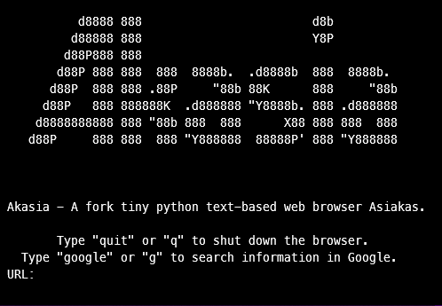

# Akasia

Hi, **Akasia** - A fork tiny python text-based web browser **Asiakas**.

## Install from PIP

You must downloading Akasia from Pypi index:

> pip install Akasia

Then you must type the command:

> Akasia

## Install from source code

You must downloading repositore of Akasia:

> git clone https://github.com/RIDERIUS/Akasia.git

Then you must type the command:

> python3 setup.py install

## Using

If you type **quit** or **q** Akasia will close.
If you type **google** or **g** Akasia will send your request google search engine.
If you type **URL site** Akasia will show site whose URL you entered.